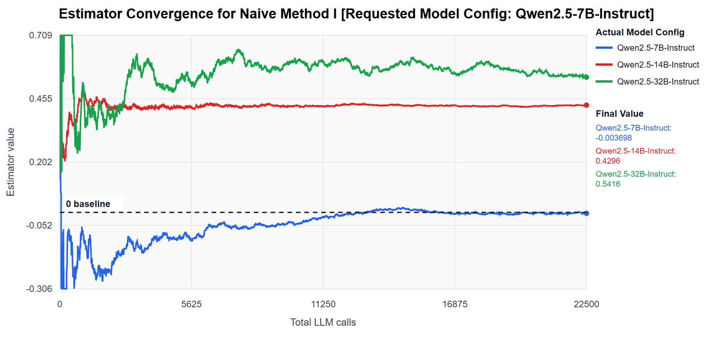
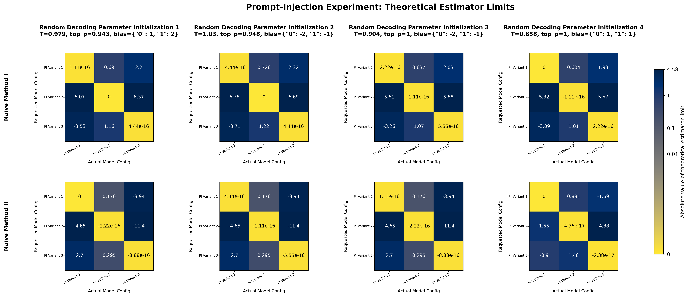
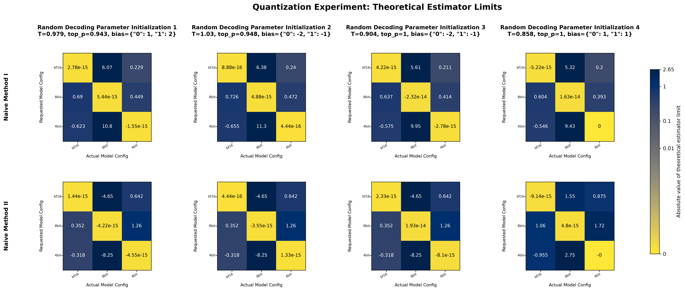

# Provable LLM Tamper Detection: Catching Model Provider Tampering of Open-Weights LLMs

Author: Jerry Bao (Contact: jerry.bao@uwaterloo.ca)

Acknowledgements: This research is supported by the Vector Scholarship in Artificial Intelligence, provided through the Vector Institute.

=======================================================================

**Important:** For the smoothest repo onboarding experience, please review the [# Understanding This Repo](#understanding-this-repo) section's clarification about framing before clicking this repo's files.

=======================================================================

## Abstract (Draft)
For those who frequently use large language model (LLM) APIs, a common concern that arises is “How do I know if the model configuration I requested is actually the model configuration I'm being served?” LLM providers can tamper their served models in various ways, such as backend model re-routing, prompt injection, logit quantization, and deploying undeclared fine-tunes of the requested model. Such tampering may affect the behavior of the served model in subtle ways that can be difficult for behavioral, heuristic, or approximate forensic methods to prove. In such cases, a mathematically provable method for detecting provider-side model tampering is required. However, a core analytical complication arises when attempting to separate the regular nonlinear distortion effects caused by hidden provider-side decoding-time parameters (e.g. temperature, logit bias, top p, etc.) from the effects caused by "genuine" model configuration tampering. Thus, at first glance, it may seem as if deriving a statistical signature for the served LLM’s underlying configuration is dependent on information the user does not have access to. However, we will demonstrate that this is not the case. This paper will introduce, to our knowledge, the first provable method of its kind for precisely detecting when an open-weights LLM provider has deviated from the model configuration it was requested to serve, regardless of the served LLM's hidden decoding-time parameters. We will do so by exploiting an invariant to derive a special class of estimators that converge to a nonzero value only if the served LLM's underlying configuration differs from the requested configuration. Furthermore, we will provide an empirical proof of concept for our method by experimentally simulating various provider-side model tampering scenarios and demonstrating our method's ability to cleanly separate the provider's deployment of a requested configuration from the provider's deployment of alternative configurations. Overall, we will demonstrate the robustness of our tamper-detection method by 1) proving a theoretical long-run precision guarantee of 100% under natural assumptions, and 2) demonstrating empirical 100% long-run recall across our multi-scenario experiments.

## Brief Research Summary
- Defined modelling assumptions.
- Derived model tampering estimators that converge to nonzero values only if the actual model configuration being served differs from the requested model configuration.
- Derived the estimators' equivalent hypothesis tests.
- Proved 100% long-run precision guarantee of the tamper-detection method.
- Proved 100% long-run recall guarantee of the tamper-detection method under strengthened assumptions.
- Conducted proof-of-concept experiments testing the method in multiple provider-side tampering scenarios: 1) the provider secretly re-routes to a different model, 2) the provider secretly modifies the system prompt, 3) the provider secretly modifies logit quantization, 4) the provider secretly deploys a fine-tune variant of the model.
- Verified empirical 100% long-run precision and recall of the tamper-detection method.
- Proved further theorems pertaining to estimator convergence speed optimization (planned to be removed and sectioned off into a later paper).

## Selected Figures:
### Scenario: The provider secretly re-routes to a different model

**Setup:**
- Requested model config: Qwen2.5-7B-Instruct
- 3 potential provider-side model configs: Qwen2.5-7B-Instruct, Qwen2.5-14B-Instruct, Qwen2.5-32B-Instruct
- Random hidden decoding parameter initialization

**Outcome:** 

The estimator converges to 0 only for the requested Qwen2.5-7B-Instruct model configuration, uniquely distinguishing its statistical profile from the unwanted re-routed alternatives.

### Scenario: The provider secretly modifies the system prompt

**Setup:**
- 3 system prompt variants
- 4 random hidden decoding parameter initializations

**Outcome:** 

The estimators converge to 0 only for the requested system prompt configurations (the diagonal squares), uniquely distinguishing their statistical profiles from the unwanted system prompt alternatives.

### Scenario: The provider secretly modifies logit quantization

**Setup:**
- 3 logit quantization variants: bf16, 8bit, 4bit
- 4 random hidden decoding parameter initializations

**Outcome:** 

The estimators converge to 0 only for the requested quantization configurations (the diagonal squares), uniquely distinguishing their statistical profiles from the unwanted quantization alternatives.

### Scenario: The provider secretly deploys a fine-tune variant of the model

**Setup:**
- 3 fine-tune variants: Qwen2.5-14B-Instruct, Qwen2.5-14B-Instruct-1M, Qwen2.5-Coder-14B-Instruct
- 4 random hidden decoding parameter initializations

**Outcome:** 

The estimators converge to 0 only for the requested fine-tune configurations (the diagonal squares), uniquely distinguishing their statistical profiles from unwanted fine-tune alternatives.

## Understanding This Repo
[PROOFS_AND_DERIVATIONS.pdf](PROOFS_AND_DERIVATIONS.pdf) contains all proofs, derivations, and theoretical results involved in this research project. It is *also* the archived version of my previous paper draft. You'll notice that it is titled *Yes, That’s Mine: Asymptotically Foolproof LLM Ownership Identification Against Hidden Adversarial Decoding Parameter Perturbations* even though this repo is titled *Provable LLM Tamper Detection: Catching Model Provider Tampering of Open-Weights LLMs*. This is intentional. I am currently rewriting the paper with a significantly different practical framing compared to the original, while keeping all core theoretical results the same. Therefore, please refer to [PROOFS_AND_DERIVATIONS.pdf](PROOFS_AND_DERIVATIONS.pdf) if you would like to see the proofs, theorems, and mathematical arguments that I will be carrying over, while keeping in mind that the new version of the paper that I am currently writing will carry a substantially different practical framing.

To see the current practical framing of the paper, please read the [Abstract (Draft)](#abstract-draft) section of this README above. You may consider this README to be fresh and up-to-date.

Repo summary:
- Refer to [PROOFS_AND_DERIVATIONS.pdf](PROOFS_AND_DERIVATIONS.pdf) purely for proofs, derivations, and theoretical results. The rest of it is now stale.
- Refer to the [experiments/model_routing_experiment](experiments/model_routing_experiment/) folder for the *model re-routing scenario* experimental code and outputs. This folder is up-to-date.
- Refer to the [experiments/prompt_injection_experiment](experiments/prompt_injection_experiment/) folder for the *prompt injection scenario* experimental code and outputs. This folder is up-to-date.
- Refer to the [experiments/quantization_level_experiment](experiments/quantization_level_experiment/) folder for the *logit quantization scenario* experimental code and outputs. This folder is up-to-date.
- Refer to the [experiments/fine_tune_experiment](experiments/fine_tune_experiment/) folder for the *fine tune deployment scenario* experimental code and outputs. This folder is up-to-date.
- The shared experiment helper modules live at [experiments/logit_helpers.py](experiments/logit_helpers.py) and [experiments/estimators.py](experiments/estimators.py).
- The [graphs](graphs/) folder stores all experimental outputs as png images. This folder is up-to-date.

## Current Status
- The core proofs and experimental results are complete.
- Secondary proofs and experiments are being considered.
- The paper will be rewritten and refactored in full with the new tamper-motivated framing. Proofs and theorems will stay mostly identical. [PROOFS_AND_DERIVATIONS.pdf](PROOFS_AND_DERIVATIONS.pdf) contains the current proof and derivation writeup. Its framing and exposition are stale relative to this README, but the core mathematical arguments remain the proof source for this project.

## Citation
If you would like to cite this work, please use:
- Title: *Provable LLM Tamper Detection: Catching Model Provider Tampering of Open-Weights LLMs*
- Author: Jerry Bao
- DOI: https://doi.org/10.5281/zenodo.18127692
- Year: 2026

