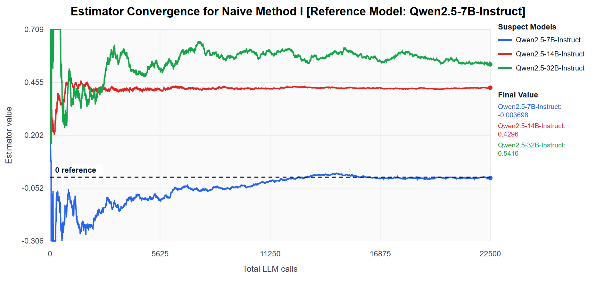
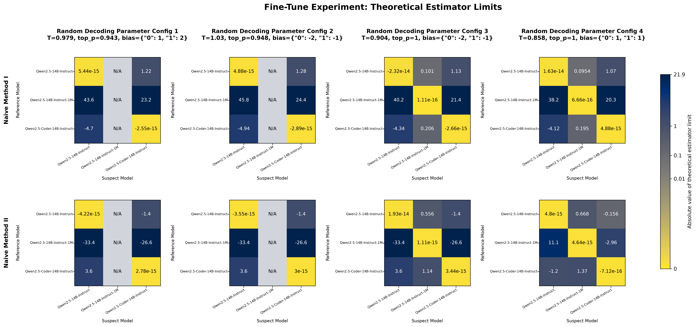
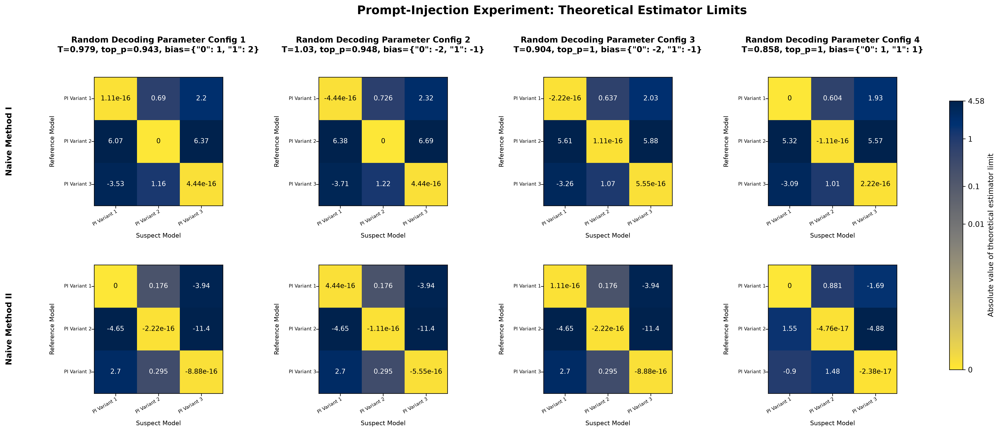

# Provable Black-Box LLM Identification: Catching Provider-Side Model Theft, Tampering, and Degradation

Author: Jerry Bao (Contact: jerry.bao@uwaterloo.ca)

Acknowledgements: This research is supported by the Vector Scholarship in Artificial Intelligence, provided through the Vector Institute.

## Abstract (Draft)
To our knowledge, this paper produces the first provable method of its kind for precisely identifying anonymous large language models under nontrivial constraints. A core difficulty in statistically proving the identity of a black-box large language model lies in the fact that the decoding-time parameters (temperature, logit bias, top p, etc.) of a fully black-box LLM are hidden from the user and nonlinearly distort the token distributions of the LLM, making the statistical signature of the LLM dependent on information the user does not have access to. In this paper, we derive a class of estimators that converge to zero whenever a “suspect” black-box LLM is indeed identical to a “reference” white-box LLM, regardless of what the black-box LLM’s decoding parameters are. Furthermore, we provide experimental proof of concept of our method by empirically demonstrating that the suspect model which is identical to the reference model can indeed be identified based on its estimator convergence behavior. This method has applications for detecting adversarial model provider-side activities such as model theft, model tampering, and model degradations such as logit quantization.

## Brief Research Summary:
- Defined modelling assumptions.
- Derived black-box LLM identification estimators and their equivalent hypothesis tests.
- Proved hypothesis test asymptotic consistency.
- Conducted proof-of-concept experiments for the method in various scenarios: 1) LLMs with distinct base models, 2) fine-tune variants of the same model, 3) system prompt variants of the same model, and 4) quantization variants of the same model.
- Proved further theorems relevant to estimator convergence speed optimization (planned to be removed and sectioned off into a later paper).

## Current status
- All proofs and experiments are complete. The core theoretical and empirical results are considered stable.
- This paper will undergo significant rewriting and refactoring prior to submission and peer review.
This paper is undergoing active modifications prior to submission and peer review. Its presentation is therefore expected to change significantly.

## Selected Figures:
### LLMs with distinct base models:

**Setup:**
- White-box reference model: Qwen2.5-7B-Instruct
- 3 anonymous (black-box) suspect models: Qwen2.5-7B-Instruct, Qwen2.5-14B-Instruct, Qwen2.5-32B-Instruct

**Outcome:** 

The identification estimator converges to 0 only for the matching suspect model, clearly distinguishing it from the others.

### Fine-tune variants of the same model:

**Setup:**
- 4 random decoding parameter configurations generated
- 3 fine-tune variants: Qwen2.5-14B-Instruct, Qwen2.5-14B-Instruct-1M, Qwen2.5-Coder-14B-Instruct

**Outcome:** 

The identification estimators converge to 0 only for the matching suspect fine-tune variants (the diagonal squares), clearly distinguishing them from the other fine-tune variants.

### System prompt variants of the same model:

**Setup:**
- 4 random decoding parameter configurations generated
- 3 system prompt variants

**Outcome:** 

The identification estimators converge to 0 only for the matching suspect system prompt variants (the diagonal squares), clearly distinguishing them from the other system prompt variants.

### Quantization variants of the same model:

**Setup:**
- 4 random decoding parameter configurations generated
- 3 logit quantization variants: bf16, 8bit, 4bit

**Outcome:** 

The identification estimators converge to 0 only for the matching suspect quantization variants (the diagonal squares), clearly distinguishing them from the other quantization variants.

## Repository Layout
- `LLM_Ownership_Identification_Latex/`: LaTeX source for the current paper draft.
- `primary_experiment/`: primary Qwen2.5 same-model detection proof-of-concept. This experiment uses reference-owned canary prompts against suspect models and contains the main convergence notebooks, prompt tracking notes, and saved logit payloads.
- `fine_tune_experiment/`: Qwen2.5-14B fine-tune comparison experiment, including prompt-selection materials, saved logit payloads, and theoretical-limit heatmaps.
- `quantization_level_experiment/`: Qwen2.5-14B quantization-level comparison experiment, including prompt-selection materials, saved logit payloads, and theoretical-limit heatmaps.
- `prompt_injection_experiment/`: Qwen2.5-14B prompt-injection / system-prompt variant experiment, including prompt-formatting variants, saved logit payloads, and theoretical-limit heatmaps.
- `assets/`: exported PNG figures generated by the graphing notebooks for README / portfolio use.
- `logit_helpers.py`: shared utilities for turning saved logit vectors into decoding-adjusted probability/CDF objects and sampling from them.
- `estimators.py`: shared implementations of the naive estimators and convergence-sequence helpers used by the experiments.
- `archived versions/`: earlier PDF snapshots of the paper.
- `LLM_Ownership_Identification_v0.9.pdf`: current exported PDF snapshot.

## Citation
If you would like to cite this work, please use:
- Title: *Yes, That's Mine: Asymptotically Foolproof LLM Ownership Identification Against Hidden Adversarial Decoding Parameter Perturbations*
- Author: Jerry Bao
- DOI: https://doi.org/10.5281/zenodo.18127692
- Year: 2026

